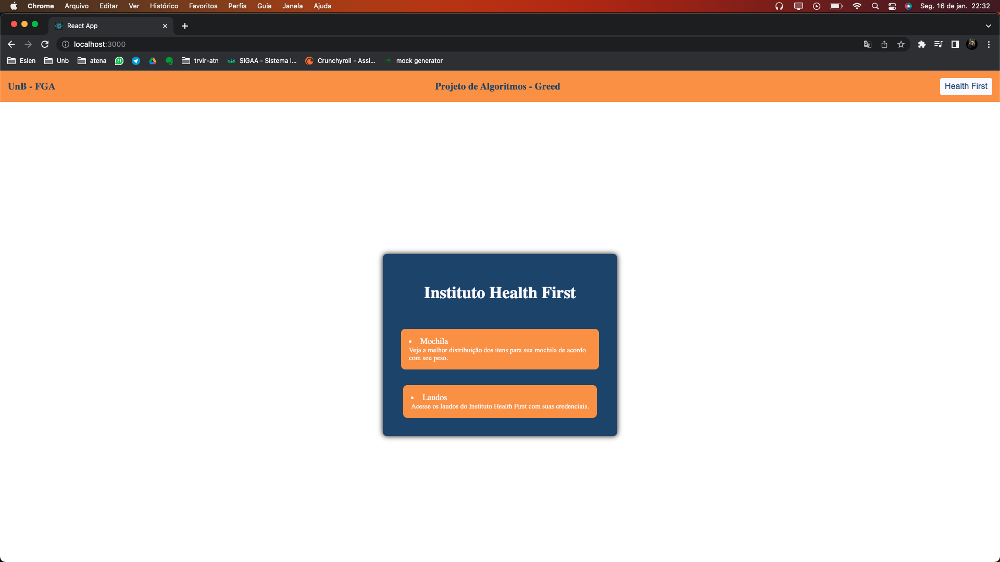
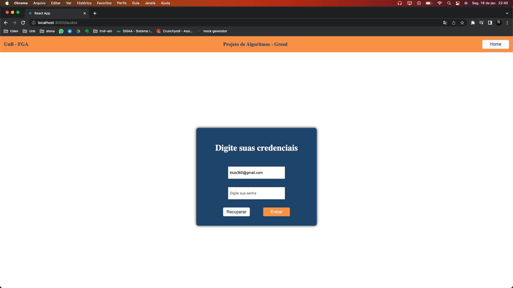
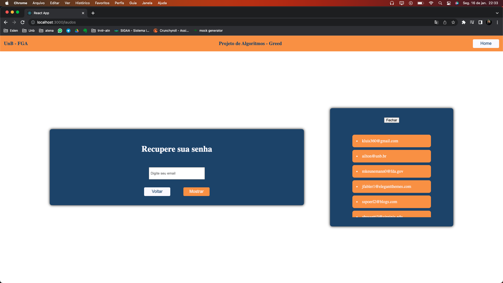
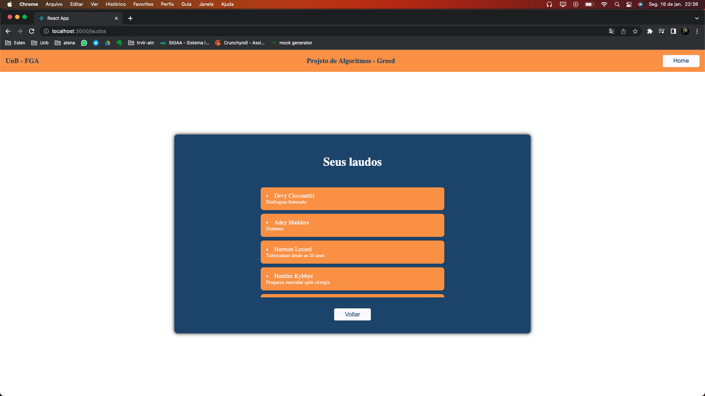
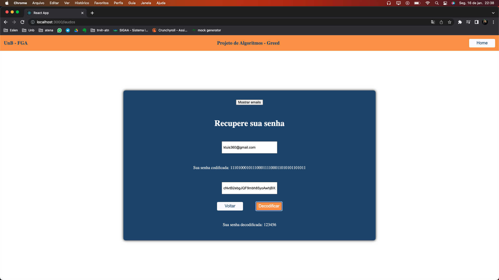
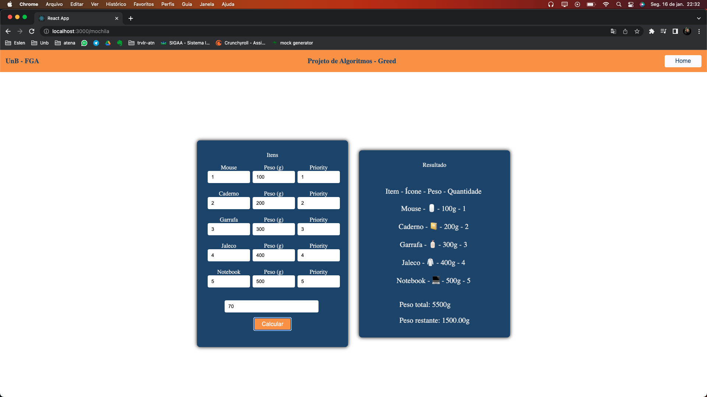

# Health First

**Número da Lista**: 3<br>
**Conteúdo da Disciplina**: Greed<br>

## Alunos

| Matrícula  | Aluno                         |
| ---------- | ----------------------------- |
| 18/0042386 | Kevin Luis Apolinario Batista |
| 18/0011600 | Ailton Aires Amado            |

## Sobre

O projeto simula o sistema de um insituto de saúde em que enxergamos a possibilidade de utilizar os algoritmos do modulo de greed:

- Organizar a mochila de acordo com o peso da pessoa, seguindo as recomendações das organizações de saúde em que o peso da mochila tem que ser até 10% do peso total da pessoa.  Aqui levamos em conta a prioridade que a pessoa atribui a um item, sua quantidade e seu peso.

- Um sistema de login que utiliza a codificação Huffman para o usuário acessar laudos do sistema. Aqui para sabermos se o usuário está colocando as credenciais corretas nós codificamos a senha que ele coloca no input e também a que está salva no sistema, se os codigos forem os mesmos, a pessoa tem acesso. Para recuperar a senha, o usuário precisa da chave secreta do sistema (é a string usada para codificar a arvore binária), com essa chave e a senha codificada em huffman, ele consegue a sequencia de caracteres que é sua senha. 

## Screenshots

### - Tela Inicial



### - Tela de login nos laudos



### - Tela com os emails disponíveis


### - Tela com os pacientes e seus laudos


### - Tela na recuperacao de senha


### - Tela na mochila


## Instalação

**Linguagem**: Javascript<br>
**Framework**: React<br>

É necessário ter o nodeJs instalado na máquina.

## Uso

```powershell
# Clone o repositório
git clone git@github.com:projeto-de-algoritmos/Greed_HealthFirst.git (ssh)

git clone https://github.com/projeto-de-algoritmos/Greed_HealthFirst.git (https)

# Entre no diretório e instale as dependencias
cd Greed_HealthFirst && npm install

# Inicie o projeto
npm start

# Visite o endereço localhost:3000 no seu navegador
```

## Outros

- O vídeo da apresentação pode ser encontrado dentro do repositório no caminho "video/apresentacao.mp4".

```
# key para mostrar as senhas

cNvtB2ebgJQF9mbh85yoAwhjBXxAwqac5Mifr0TfmlFj1LzJjTs9KROtZe29Gd12tnh9k2qGNwQpY7S3V0xzLY4BJGg6IVg30QGrVuXN3d0DunGIfyLKD4kEOjpjIOHpOrq7qN25kBA17DtvTzYZpQgqm5hJhvyy5j4BuVePVoDNkRchpsL9gReQYlxipfVu3uoNTysJS5Q96CkA4XvfHwmaQq5evk8iSnfwcSawXkBTtNsBV9nVfRxAkD0OH1LfySp5ows2SHUqH40yXc6lrSKcOnfFT6Z61sN1ABPTAxxsoOEA8v28fMLIs7pIzVsjPvwc9zbM9fVWJT8hvC1PEpWpmhHuI2Osbizz7mhq5CJx7ERp6pe8cauozydBtSHm75TVPueywvg3nGxFJLde2EICoU7652fIdpmlxQuKS8aubj64F6arcHTzDWNaCmqg2MnRgBJ8qTlOGigKuOcclakJRDF0LzsV29hvyfli2lKmlhAfcWjrJoZtPA6CdsQniwNdr0mzSTs4eJ6TDnt94NzONed9q0OvWJs3zmC1377REmypSeTPQ0JOlRhaXzGmgnlNcxjJSxQfpO2pibSqBOHzShpkpqoPlSns79ACIki0GvWPTZHWmmd7dtKrS7IfqMs5phY1cZNuwrp79gixiMKe6BLxHkemPw6ZvVMcPvxue8w84CxN3FZESmhuWyhiNuiWzVR0uhIjS3yQAoCENXewZEdvTb7S4uygO4WfouquwZA0jWLZnzVRdqUkCxGw8Ww3aao2dNixxl24eNCcGcmhX0UvjXPKvqQKJ1bCeAxnzxFf6WiNLbbVRyOIOLA6oy7xgjxgtbs8MMJia6LUxRTtho7IEpSLW6vDuDIvulpUji2Pt2Y8XfKZxhJ2uRxCFAxdrEQGiCec0MUB0lGCr3tCereI0iiRd8BOBAsBsiaEfXOTdxtIXJUzG59zk4AKT2iTxSyj0hRAmfgdrhlzKOu6d8At1em4LVmEEWFUQlCDLRFANB6wXbHlPbHy5itBjmrGlVWmRWAfniM6wL84q1bPXgQ4qHSfEf8uA70ZfBI7k5TAo4fc7ALDWcx4cHPbKRUffEKndpovmErOwrGeoi7PekL4vmaGk0b6Ou5LV6Vsrfnsm9FEnBf87nKu2p3njsdFpeSQtAHQmOUSjXtXDKitkilUZi4FugEOPziHHE4k7hSlp8h6cnayPgvHpbLBCmnrjvVYsJnPdoGdlJeRcKEonqBtdvYnFT81kH0iGYqsijkGEzvwAbh3yg8piuNHqMdonoi5ZzUHcfpI6QAo3ArZfev5S0cofi8qnCqKhSVyb5OWTtYxuK4Aod3T5kj7RZRXRBhDTV0aoCqmhp0mNZKkFQ3dhkPEcMdMhysjgV4DvgXL7Hap
```